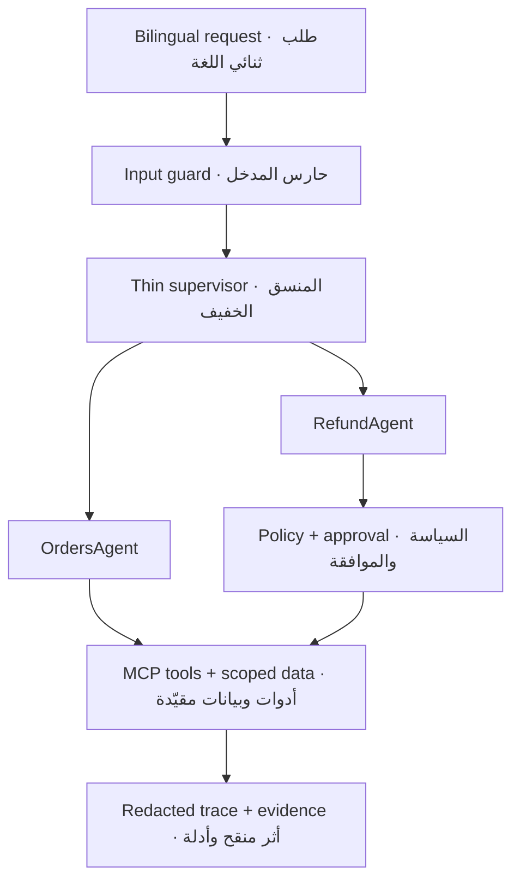

# Rafeeq Mini Labs · لابات رفيق المصغّر

[](CHANGELOG.md)
[](https://almiyead-rgb.github.io/rafeeq-agentic-ai-labs/)
[](https://almiyead-rgb.github.io/rafeeq-agentic-ai-labs/compare.html)
[](https://colab.research.google.com/github/almiyead-rgb/rafeeq-agentic-ai-labs/blob/v0.9.0-rc3/notebooks/Rafeeq_Mini_Capstone.ipynb)
[](.env.example)

**Rafeeq Mini** is one cumulative, bilingual **guided-engineering mini-capstone** for the three-day course **Advanced Agentic AI Systems Engineering**. Learners build a safe delivery-support agent in small stages, test every stage, and export an auditable GitHub submission. It is a supervised engineering simulation—not a production deployment or an open-ended software assignment.

**رفيق المصغّر** مشروع **هندسة موجهة** تراكمي وثنائي اللغة لدورة **هندسة أنظمة الذكاء الاصطناعي التوكيلي المتقدمة** الممتدة ثلاثة أيام. يبني المتدرب مساعد دعم لعمليات التوصيل على مراحل صغيرة، ويختبر كل مرحلة، ثم يصدّر تسليمًا قابلًا للتدقيق على GitHub. وهو محاكاة هندسية تحت الإشراف، لا نشر إنتاجي ولا تكليف برمجي مفتوح النطاق.

> Release candidate `0.9.0-rc3`: automated repository, CI, and Pages checks are verified; the clean-account hosted-Colab acceptance remains manual. Start from the [bilingual learner portal](https://almiyead-rgb.github.io/rafeeq-agentic-ai-labs/). The mandatory path uses Google Colab Free CPU, `LLM_MODE=stub`, synthetic data, and no API key, GPU, terminal, PAT, or paid service.
>
> مرشح الإصدار `0.9.0-rc3`: اكتملت فحوص المستودع وCI وPages الآلية، وتبقى تجربة القبول البشرية في Colab بحساب نظيف. ابدأ من [بوابة المتدرب الثنائية اللغة](https://almiyead-rgb.github.io/rafeeq-agentic-ai-labs/). يعمل المسار الإلزامي على Colab المجاني وCPU، بالوضع `LLM_MODE=stub` وبيانات مصطنعة، بلا مفتاح API أو GPU أو طرفية أو PAT أو خدمة مدفوعة.

## Start · ابدأ

| English | العربية |
|---|---|
| 1. Sign in to a personal [GitHub account](https://github.com/signup) and verify your email. | 1. سجّل الدخول إلى [حساب GitHub](https://github.com/signup) شخصي ووثّق بريدك. |
| 2. During preflight, create a new public repository, add a clear GitHub **About** description, and create only `LEARNING_PROGRESS.md` from the [safe template](docs/LEARNING_PROGRESS_TEMPLATE.md). | 2. أثناء التجهيز المسبق أنشئ مستودعًا عامًا جديدًا، وأضف وصفًا واضحًا في **About**، وأنشئ فقط ملف `LEARNING_PROGRESS.md` من [القالب الآمن](docs/LEARNING_PROGRESS_TEMPLATE.md). |
| 3. Open the cumulative notebook using the button below, then choose **File → Save a copy in Drive**. | 3. افتح الدفتر التراكمي من الزر أدناه، ثم اختر **File → Save a copy in Drive**. |
| 4. Select the standard CPU runtime and run `C0_ENV_DOCTOR`. Success is `C0 = READY`. | 4. اختر بيئة CPU القياسية وشغّل `C0_ENV_DOCTOR`. علامة النجاح هي `C0 = READY`. |
| 5. After C9 and C20, update only the safe progress log with a meaningful documentation commit. After C29 prints `FINAL_EXPORT_CREATED`, upload the clean files and wait for **Learner submission quality** to turn green. | 5. بعد C9 وC20 حدّث سجل التقدم الآمن فقط عبر Commit توثيقي واضح. وبعد أن تطبع C29 العبارة `FINAL_EXPORT_CREATED` ارفع الملفات النظيفة وانتظر نجاح **Learner submission quality**. |

### [Open Rafeeq Mini in Google Colab · افتح رفيق المصغّر في كولاب](https://colab.research.google.com/github/almiyead-rgb/rafeeq-agentic-ai-labs/blob/v0.9.0-rc3/notebooks/Rafeeq_Mini_Capstone.ipynb)

Detailed beginner instructions are in [the learner guide](docs/learner-guide.md). If the runtime disconnects, follow [the recovery guide](recovery/README.md); you do not need to restart the whole project.

توجد تعليمات المبتدئ المفصلة في [دليل المتدرب](docs/learner-guide.md). وإذا انقطعت بيئة التشغيل، فاتبع [دليل الاستعادة](recovery/README.md)؛ لا تحتاج إلى إعادة المشروع كله.

Use the instructor-assigned `learner_id` or your GitHub username in public files. Put your real name, email, phone number, national ID, or other identifying information only in the private hand-in form provided by the instructor.

استخدم `learner_id` الذي تقدمه المدربة أو اسم مستخدم GitHub داخل الملفات العامة. ضع الاسم الحقيقي أو البريد أو رقم الهاتف أو الهوية الوطنية أو أي بيانات تعريفية أخرى في نموذج التسليم الخاص الذي تقدمه المدربة فقط.

If an employer or institutional policy prevents a public repository, notify the instructor before Day 1 and use only the instructor-approved private hand-in route; do not post a private repository link in a public issue.

إذا منعت سياسة جهة العمل أو المؤسسة إنشاء مستودع عام، فأبلغ المدربة قبل اليوم الأول واستخدم مسار التسليم الخاص الذي تعتمده فقط، ولا تنشر رابط مستودع خاص في Issue عام.

## Validated reference outputs · مخرجات مرجعية متحققة

Finish your own attempt first, then compare the **evidence produced by the notebook**—not your code—with the validated reference contracts. The references cover the day gates, security retest, readiness, assessment, and final export while intentionally omitting solution code, TODO answers, private reasoning, hidden tests, and grades.

أكمل محاولتك أولًا، ثم قارن **الأدلة التي أنشأها الدفتر**—وليس الكود—بالعقود المرجعية المتحققة. تغطي المراجع بوابات الأيام، وإعادة اختبار الأمن، والجاهزية، والتقييم، والتصدير النهائي، مع استبعاد كود الحل وإجابات المهام والتفكير الخاص والاختبارات الخفية والدرجات عمدًا.

| English | العربية |
|---|---|
| [Open the visual comparison page](https://almiyead-rgb.github.io/rafeeq-agentic-ai-labs/compare.html) and choose one of your generated JSON files. Comparison runs locally in your browser. | [افتح صفحة المقارنة المرئية](https://almiyead-rgb.github.io/rafeeq-agentic-ai-labs/compare.html) واختر أحد ملفات JSON الناتجة لديك. تتم المقارنة محليًا داخل متصفحك. |
| [Browse the versioned reference contracts](reference-results/) to inspect the expected, stable behaviors for each stage. | [تصفح العقود المرجعية ذات الإصدار](reference-results/) لفحص السلوكيات الثابتة المتوقعة في كل مرحلة. |

The comparison checks stable behaviors such as pass/fail gates, case IDs, safety decisions, bounded execution, and required artifacts. It deliberately ignores timestamps, generated IDs, paths, hashes, file sizes, and latency because those legitimately vary between runs.

تفحص المقارنة السلوكيات الثابتة مثل نجاح البوابات، ومعرّفات الحالات، وقرارات السلامة، وحدود التنفيذ، والملفات المطلوبة. وتتجاهل عمدًا الطوابع الزمنية والمعرّفات المولدة والمسارات والبصمات والأحجام وزمن الاستجابة لأنها تختلف طبيعيًا بين تشغيل وآخر.

## Project scenario · سيناريو المشروع

A customer contacts the fictional delivery company **Tawseel** in Arabic or English to ask about an order or request a refund. Rafeeq detects the intent and order ID, verifies ownership through a scoped tool, retrieves only the active policy, delegates to the correct specialist, and records a redacted trace. Refunds require a delay greater than two days; amounts above SAR 500 pause for explicit human approval. Re-running a write remains safe through deterministic idempotency.

يتواصل عميل مع شركة التوصيل الافتراضية **توصيل** بالعربية أو الإنجليزية للسؤال عن طلب أو طلب استرداد. يحدد رفيق النية ورقم الطلب، ويتحقق من الملكية عبر أداة مقيّدة، ويسترجع السياسة السارية فقط، ويفوض المهمة للوكيل المتخصص، ويسجل أثرًا منقحًا. يشترط الاسترداد تأخرًا يزيد على يومين، وتتوقف المبالغ الأعلى من 500 ريال حتى تصدر موافقة بشرية صريحة. وتظل إعادة خلية الكتابة آمنة بفضل مفتاح منع التكرار الحتمي.



## Three-day build · البناء خلال ثلاثة أيام

| Day | Cells | Build outcome · ناتج البناء | Gate · البوابة |
|---|---:|---|---|
| 1 · Core & tools · النواة والأدوات | C0–C9 | Typed state, bounded graph, ReAct, schemas, and a real local MCP `stdio` connection · حالة محددة النوع، مخطط محدود، ReAct، مخططات أدوات، واتصال MCP محلي فعلي | `C9_DAY1_GATE` |
| 2 · Memory & orchestration · الذاكرة والتنسيق | C10–C20 | Session memory, scoped recall, policy retrieval, two specialists, typed delegation, planning, refund gate, and interrupt/resume · ذاكرة جلسية، استرجاع مقيّد، سياسات، وكيلان متخصصان، تفويض، تخطيط، بوابة استرداد، وتوقف/استئناف | `C20_DAY2_GATE` |
| 3 · Security & evidence · الأمن والأدلة | C21–C29 | Threat model, attack suite, guard repair, bounded reflection, traces, one measured optimization, scorecard, readiness, and safe export · نموذج تهديد، اختبارات هجوم، إصلاح الحواجز، انعكاس محدود، آثار، تحسين مقاس واحد، بطاقة نتائج، جاهزية، وتصدير آمن | `C29_EXPORT_SAFETY_CHECK` |

### Core and stretch · المسار الأساسي ومسار التوسع

| Path | Rule · القاعدة |
|---|---|
| **Core · أساسي** | The 14 learner TODOs, C0–C29 in order, the three gates, required reports/evidence, SDAIA administrative evidence, clean GitHub upload, and green Actions check are mandatory for assessment. · مهام المتدرب الـ14 وتشغيل C0–C29 بالترتيب والبوابات الثلاث والتقارير/الأدلة ومتطلبات سدايا الإدارية ورفع GitHub النظيف ونجاح Actions إلزامية للتقييم. |
| **Stretch · توسع** | Only extensions explicitly marked or announced by the instructor are optional. They never replace a failed core gate and do not disadvantage beginners who complete the core path. · الامتدادات التي تحددها أو تعلنها المدربة فقط اختيارية؛ لا تعوض بوابة أساسية فاشلة ولا تضر بالمبتدئ الذي يكمل المسار الأساسي. |

The notebook contains exactly 30 named sections and 14 short learner TODOs. The rest is runnable scaffolding, tests, hints, and evidence generation. Private answer keys, hidden evaluations, grades, and instructor checkpoints are intentionally absent.

يحتوي الدفتر على 30 قسمًا مسمى و14 مهمة قصيرة فقط للمتدرب. أما الباقي فهو بنية تشغيلية واختبارات وتلميحات وتوليد أدلة. لا يتضمن المستودع مفاتيح إجابة أو تقييمات خفية أو درجات أو نقاط استعادة للمدربة.

## SDAIA administrative requirements · متطلبات سدايا الإدارية

The project is the complete course assessment (`100/100`). The existing
15-point GitHub-delivery area contains **10 points for SDAIA administrative
requirements** and **5 points for technical delivery evidence**; nothing is
added above 100.

المشروع هو تقييم الدورة كاملًا (`100/100`). يتضمن محور تسليم GitHub الحالي
من 15 درجة **10 درجات لمتطلبات سدايا الإدارية** و**5 درجات لأدلة التسليم
التقني**؛ ولا تضاف أي درجة فوق 100.

| Assessed requirement · المتطلب المقيم | Points · الدرجة |
|---|---:|
| Clear, comprehensive repository description · وصف واضح وشامل للمستودع | 2 |
| Professional README: idea, run, and use · README احترافي: الفكرة والتشغيل والاستخدام | 2 |
| Appropriate linked technical documentation · توثيق فني مناسب ومترابط | 2 |
| Meaningful, safe Git version history · سجل Git آمن وذو معنى | 2 |
| Training-program reference · الإشارة إلى البرنامج التدريبي | 1 |
| Working [SDAIA Academy GitHub](https://github.com/SDAIAAcademy) link · رابط أكاديمية سدايا الصحيح | 1 |
| **Administrative subtotal · المجموع الإداري** | **10** |

Read the [full administrative evidence standard and safe daily Git path](docs/SDAIA_ADMIN_REQUIREMENTS.md). The SDAIA course-evaluation link is shared at the start of the final day and completed through the designated private channel; it has no project points, and its responses or screenshots never belong in GitHub. Stars, Follow, open-source contributions, Fork, Pull Requests, Issues, and community sharing are encouraged only when appropriate and are **not graded**.

راجع [معيار الأدلة الإدارية ومسار Git اليومي الآمن](docs/SDAIA_ADMIN_REQUIREMENTS.md). يشارك رابط تقييم الدورة في بداية اليوم الأخير ويستكمل عبر القناة الخاصة المحددة؛ ولا يحمل درجات للمشروع، ولا تنشر إجاباته أو لقطاته في GitHub. أما Stars وFollow والمساهمات مفتوحة المصدر وFork وPull Requests وIssues والمشاركة المجتمعية فهي تشجيعية عند ملاءمتها و**غير مقيمة**.

## Final learner outputs · مخرجات المتدرب النهائية

- Deployable, dependency-light Python package and local MCP server · حزمة Python قابلة للتشغيل وخادم MCP محلي.
- `reports/PROJECT_REPORT.md` · تقرير المشروع.
- `reports/SECURITY_ASSESSMENT.md` · تقرير الأمن وإعادة الاختبار.
- `reports/trace.jsonl` and `reports/assessment_results.json` · أثر منقح ونتائج تقييم.
- `reports/monitoring_dashboard.png` · لوحة مراقبة ثابتة.
- `reports/submission_manifest.json` and a clean submission ZIP · بيان ملفات وحزمة تسليم نظيفة.
- `reports/EVIDENCE_CARD.md`, completed from the template with one concise card for each day; it is a required instructor-assessment record added after extracting the C29 package. · ملف `reports/EVIDENCE_CARD.md` مكتمل من القالب ببطاقة مختصرة لكل يوم؛ وهو سجل إلزامي لتقييم المدربة يضاف بعد فك حزمة C29.
- `LEARNING_PROGRESS.md` with safe setup, Day 1, Day 2, and final-delivery checkpoints. · ملف `LEARNING_PROGRESS.md` بنقاط تقدم آمنة للتجهيز واليومين الأول والثاني والتسليم النهائي.

## Submit and receive confirmation · سلّم واستلم التأكيد

| Item | Authoritative instruction · التعليمات المعتمدة |
|---|---|
| Deadline · الموعد النهائي | Provided by the instructor during the course; no date in this public repository overrides it. · تقدمه المدربة أثناء الدورة، ولا يتجاوزُه أي تاريخ في هذا المستودع العام. |
| Hand-in form · نموذج التسليم | The private form/link is provided by the instructor. Submit the public repository URL and the final commit URL there. · تقدم المدربة رابط النموذج الخاص؛ أرسل فيه رابط المستودع العام ورابط آخر Commit. |
| Automated verification · التحقق الآلي | Open **Actions → Learner submission quality** and wait for the final commit to show a green check. A red run is not ready for hand-in. · افتح **Actions ← Learner submission quality** وانتظر العلامة الخضراء لآخر Commit؛ التشغيل الأحمر غير جاهز للتسليم. |
| Receipt · إثبات الاستلام | The confirmation issued by the instructor/form is the receipt. A green Actions check or a submitted screenshot alone is not a receipt. · التأكيد الصادر من المدربة أو النموذج هو إثبات الاستلام؛ ولا تكفي علامة Actions الخضراء أو لقطة الشاشة وحدها. |
| Resubmission · إعادة التسليم | Preserve commit history, repair from the saved Drive notebook, regenerate affected evidence through C29, upload a new commit, wait for green Actions, then submit the new commit URL using the instructor's stated policy. · احتفظ بسجل Commits، وأصلح من دفتر Drive المحفوظ، وأعد توليد الأدلة المتأثرة حتى C29، وارفع Commit جديدًا، وانتظر نجاح Actions، ثم أرسل رابط Commit الجديد وفق سياسة المدربة. |

Read the complete, public [100-point assessment rubric](docs/ASSESSMENT_RUBRIC.md) and [SDAIA administrative requirements](docs/SDAIA_ADMIN_REQUIREMENTS.md) before starting the final export. The passing threshold is 70/100, and every non-compensable gate must also pass. · اقرأ [معيار التقييم العام الكامل من 100 درجة](docs/ASSESSMENT_RUBRIC.md) و[متطلبات سدايا الإدارية](docs/SDAIA_ADMIN_REQUIREMENTS.md) قبل بدء التصدير النهائي. درجة الاجتياز 70/100، مع ضرورة نجاح جميع البوابات غير القابلة للتعويض.

For a public, sanitized technical question, open the bilingual [Lab help issue form](https://github.com/almiyead-rgb/rafeeq-agentic-ai-labs/issues/new?template=lab-help.yml). Never use it for a credential, vulnerability, private link, personal data, grade dispute, or private submission detail; follow [SECURITY.md](SECURITY.md) and the instructor's private channel instead.

للسؤال التقني العام والمنقح افتح [نموذج مساعدة اللاب الثنائي](https://github.com/almiyead-rgb/rafeeq-agentic-ai-labs/issues/new?template=lab-help.yml). لا تستخدمه لبيانات دخول أو ثغرة أو رابط خاص أو بيانات شخصية أو اعتراض على درجة أو تفاصيل تسليم خاصة؛ اتبع [SECURITY.md](SECURITY.md) وقناة المدربة الخاصة بدلًا منه.

## Repository map · خريطة المستودع

| Path | Purpose · الغرض |
|---|---|
| `notebooks/` | Cumulative Colab notebook and cell map · الدفتر التراكمي وخريطة الخلايا |
| `src/rafeeq/` | Typed state, graph, agents, memory, retrieval, guards, tracing, assessment · النواة البرمجية |
| `mcp_server/` | Dependency-free educational MCP `stdio` server · خادم MCP تعليمي بلا اعتماديات |
| `data/public/` | Versioned synthetic learner datasets · بيانات مصطنعة عامة بإصدار محدد |
| `tests/public/` | Learner-visible contract and safety tests · اختبارات العقود والسلامة المرئية |
| `tests/schemas/` | JSON contracts for state, traces, assessment, and export · عقود JSON |
| `scripts/` | Doctor, gates, assessment, demo, validation, and safe export · أدوات التشغيل والتحقق |
| `reports/templates/` | Bilingual evidence and report templates · قوالب التقارير والأدلة |
| `reference-results/` | Versioned, result-only comparison contracts; no solution code · عقود مقارنة للنتائج فقط وذات إصدار؛ بلا كود حلول |
| `recovery/` | Restart and checkpoint guidance · إرشادات الاستعادة ونقاط الحفظ |
| `docs/` | Bilingual learner portal · بوابة المتدرب الثنائية |
| `docs/SDAIA_ADMIN_REQUIREMENTS.md` | Assessed administrative requirements and evidence · المتطلبات الإدارية المقيمة وأدلتها |
| `docs/LEARNING_PROGRESS_TEMPLATE.md` | Safe browser-only daily Git progress template · قالب تقدم Git يومي آمن من المتصفح |

## Local verification · التحقق المحلي

No installation is required for the core verification path:

```bash
python scripts/doctor.py
python -m unittest discover -s tests/public -p "test_*.py" -v
python scripts/validate_notebook.py
python scripts/run_assessment.py
python scripts/validate_release.py
```

لا يحتاج مسار التحقق الأساسي إلى تثبيت. جميع البيانات تعليمية مصطنعة، وجميع عمليات الاسترداد محاكاة لا تنفذ معاملة مالية.

## Safety boundary · حدود السلامة

- Never enter real customer or trainee data, credentials, private links, tokens, or API keys.
- Trusted identity and approval context are attached by the host runtime, never accepted as model-controlled tool arguments.
- Traces store decisions, counters, codes, and short rationale only—never raw prompts or private chain-of-thought.
- Read operations may receive one bounded retry for a transient failure; write operations are never retried automatically.
- Hidden tests, solutions, instructor notes, and real recovery checkpoints belong in a separate private repository—not a branch or tag here.

---

- لا تدخل بيانات حقيقية لعميل أو متدرب، أو بيانات دخول، أو روابط خاصة، أو رموزًا، أو مفاتيح API.
- يضيف المضيف هوية العميل وسياق الموافقة الموثوق، ولا تقبلهما الأدوات ضمن معاملات يسيطر عليها النموذج.
- تسجل الآثار القرارات والعدادات والرموز ومبررًا قصيرًا فقط، ولا تسجل الأمر الخام أو سلسلة التفكير الخاصة.
- قد تعاد عملية القراءة مرة واحدة فقط عند فشل عابر؛ ولا تعاد عملية الكتابة تلقائيًا.
- مكان الاختبارات الخفية والحلول وملاحظات المدربة ونقاط الاستعادة الحقيقية مستودع خاص منفصل، وليس فرعًا أو وسمًا هنا.

## Instructor · المدربة

**Meaad Al-Marri · ميعاد المري**

[SDAIA Academy on GitHub](https://github.com/SDAIAAcademy) is provided only as an external reference. This repository does not use an official logo or claim institutional endorsement, approval, or ownership.

يُعرض رابط [أكاديمية سدايا على GitHub](https://github.com/SDAIAAcademy) بوصفه مرجعًا خارجيًا فقط. لا يستخدم المستودع شعارًا رسميًا ولا يدّعي اعتمادًا أو موافقة أو ملكية مؤسسية.

Educational simulation only · محاكاة تعليمية فقط. Learner reuse is governed by the limited [Course use permission](COURSE_USE_PERMISSION.md); it is not a broad open-source license. · يخضع استخدام المتدرب لـ[إذن استخدام مواد الدورة](COURSE_USE_PERMISSION.md) المحدود، وليس لترخيص مفتوح المصدر واسع.
